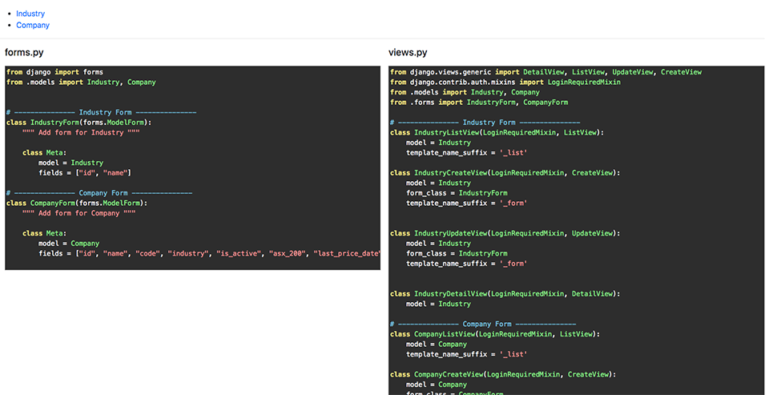
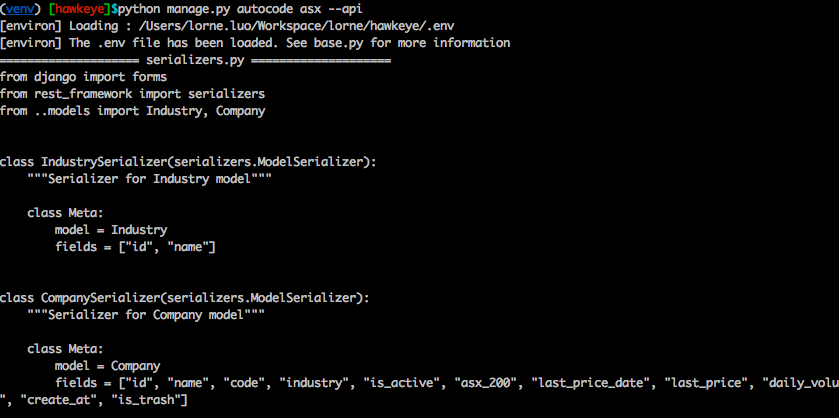

# Django-Autocode

Django-Autocode is a [Django](http://www.djangoproject.com/) package that could generate forms/views/urls/api/templates codes for your Django model.

Once model's definition finished, this package could help you generate the code for corresponding forms/views/urls/api/templates with one click.

## Installation

**pip**
```
pip install git+https://github.com/lorne-luo/django-autocode.git
```

**settings.py**
```
if DEBUG:
    INSTALLED_APPS += [
        'autocode',
    ]
```

**urls.py**
```
from django.conf import settings

if settings.DEBUG:
    urlpatterns += [
        url(r'', include('autocode.urls', namespace='autocode')),
    ]
```

## Usage


### 1. From browser

Generate all code for app 

`http://localhost/autocode/{app_name}/`

Generate code for specific model

`http://localhost/autocode/{app_name}/{model name}/`

Example:

`http://localhost/autocode/auth/`

`http://localhost/autocode/auth/Group/`




### 2. Django command

`python manage.py autocode {app name} [--view, --api, --template]`

`python manage.py autocode {app name}.{model name} [--view, --api, --template]`

`python manage.py autocode {app folder path} [--view, --api, --template]`

Example:

`python manage.py autocode auth`

`python manage.py autocode auth.Group --api`

`python manage.py autocode apps/product/ --template`




## Customize the code generation
Simply create following .html in templates folder to overwrite the default:
```
autocode/templates/autocode/code/admin.py.html
autocode/templates/autocode/code/api_views.py.html
autocode/templates/autocode/code/forms.py.html
autocode/templates/autocode/code/serializers.py.html
autocode/templates/autocode/code/urls.py.html
autocode/templates/autocode/code/views.py.html
autocode/templates/autocode/code/{model}_form.html.html
autocode/templates/autocode/code/{model}_list.html.html
```
